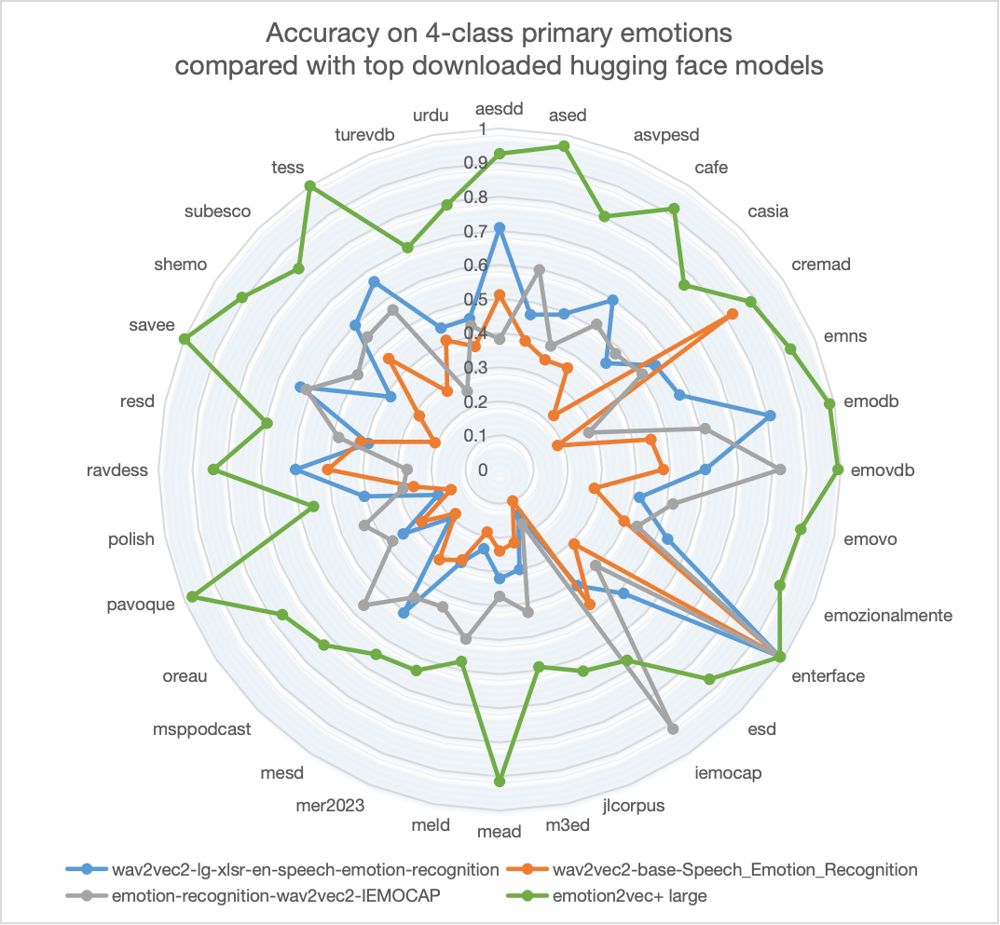

---
frameworks:
- Pytorch
license: Apache License 2.0
tasks:
- emotion-recognition
widgets:
  - enable: true
    version: 1
    task: emotion-recognition
    examples:
      - inputs:
          - data: git://example/test.wav
    inputs:
      - type: audio
        displayType: AudioUploader
        validator:
          max_size: 10M
        name: input
    output:
      displayType: Prediction
      displayValueMapping:
        labels: labels
        scores: scores
    inferencespec:
      cpu: 8
      gpu: 0
      gpu_memory: 0
      memory: 4096
    model_revision: master
    extendsParameters:
      extract_embedding: false
---


<div align="center">
    <h1>
    EMOTION2VEC+
    </h1>
    <p>
    emotion2vec+通用语音情感识别系列基座模型 <br>
    <b>emotion2vec+large模型</b>
    </p>
    <p>
    
    </p>
    <p>
    </p>
</div>

# 模型列表
GitHub 仓库: [emotion2vec](https://github.com/ddlBoJack/emotion2vec)
|模型|⭐Model Scope|🤗Hugging Face|Fine-tuning数据量（小时）|
|:---:|:-------------:|:-----------:|:-------------:|
|emotion2vec|[Link](https://www.modelscope.cn/models/iic/emotion2vec_base/summary)|[Link](https://huggingface.co/emotion2vec/emotion2vec_base)|/|
emotion2vec+ seed|[Link](https://modelscope.cn/models/iic/emotion2vec_plus_seed/summary)|[Link](https://huggingface.co/emotion2vec/emotion2vec_plus_seed)|201|
emotion2vec+ base|[Link](https://modelscope.cn/models/iic/emotion2vec_plus_base/summary)|[Link](https://huggingface.co/emotion2vec/emotion2vec_plus_base)|4788|
emotion2vec+ large|[Link](https://modelscope.cn/models/iic/emotion2vec_plus_large/summary)|[Link](https://huggingface.co/emotion2vec/emotion2vec_plus_large)|42526|


# 模型简介
emotion2vec+(emotion2vec_plus)是语音情感识别基座模型，我们致力于打造语音情感领域的Whisper，通过数据驱动方法尽可能克服语种和录制场景对情感识别的影响，获得通用、鲁棒的情感识别的能力。emotion2vec+的性能显著超过其他高下载量的huggingface开源模型。



本版本(emotion2vec_plus_seed)为使用筛选后的大规模伪标注数据进行finetune，获得的 large size（~300M）模型，目前支持的分类为：
    0: angry
    1: disgusted
    2: fearful
    3: happy
    4: neutral
    5: other
    6: sad
    7: surprised
    8: unknown


# 数据迭代

我们提供三个版本，每个版本由前一个版本的数据迭代而来。如果需要情感表征模型，可以参考 [emotion2vec](https://github.com/ddlBoJack/emotion2vec)。
- [emotion2vec+ seed](https://modelscope.cn/models/iic/emotion2vec_plus_seed/summary): 使用来自[EmoBox](https://github.com/emo-box/EmoBox)学术语音情感数据进行finetune
- [emotion2vec+ base](https://modelscope.cn/models/iic/emotion2vec_plus_base/summary): 使用筛选后的大规模伪标注数据进行finetune，获得的base size（~90M）模型
- [emotion2vec+ large](https://modelscope.cn/models/iic/emotion2vec_plus_large/summary): 使用筛选后的大规模伪标注数据进行finetune，获得的 large size（~300M）模型

迭代流程如图所示，最终我们获得四万小时情感数据进行训练emotion2vec+ large模型。

# 安装环境

`pip install -U funasr modelscope`

# 用法

input: 16k Hz 的语音

granularity:
- "utterance": 提取整句语音特征
- "frame": 提取帧级别特征(50 Hz)

extract_embedding: 是否提取特征，如果只使用分类模型不需要特征这里设置为False

## 基于modelscope进行推理

```python
from modelscope.pipelines import pipeline
from modelscope.utils.constant import Tasks

inference_pipeline = pipeline(
    task=Tasks.emotion_recognition,
    model="iic/emotion2vec_plus_large")

rec_result = inference_pipeline('https://isv-data.oss-cn-hangzhou.aliyuncs.com/ics/MaaS/ASR/test_audio/asr_example_zh.wav', granularity="utterance", extract_embedding=False)
print(rec_result)
```


## 基于FunASR进行推理

```python
from funasr import AutoModel

model = AutoModel(model="iic/emotion2vec_plus_large")

wav_file = f"{model.model_path}/example/test.wav"
res = model.generate(wav_file, output_dir="./outputs", granularity="utterance", extract_embedding=False)
print(res)
```
注：模型会自动下载

支持输入文件列表，wav.scp（kaldi风格）：
```cat wav.scp
wav_name1 wav_path1.wav
wav_name2 wav_path2.wav
...
```

输出为情感表征向量，保存在`output_dir`中，格式为numpy格式（可以用np.load()加载）

# 说明

本仓库为emotion2vec的modelscope版本，模型参数完全一致。

原始仓库地址: [https://github.com/ddlBoJack/emotion2vec](https://github.com/ddlBoJack/emotion2vec)

modelscope版本仓库：[https://github.com/alibaba-damo-academy/FunASR](https://github.com/alibaba-damo-academy/FunASR/tree/funasr1.0/examples/industrial_data_pretraining/emotion2vec)

huggingface仓库：[https://huggingface.co/emotion2vec](https://huggingface.co/emotion2vec)

# 相关论文以及引用信息
```BibTeX
@article{ma2023emotion2vec,
  title={emotion2vec: Self-Supervised Pre-Training for Speech Emotion Representation},
  author={Ma, Ziyang and Zheng, Zhisheng and Ye, Jiaxin and Li, Jinchao and Gao, Zhifu and Zhang, Shiliang and Chen, Xie},
  journal={arXiv preprint arXiv:2312.15185},
  year={2023}
}
```